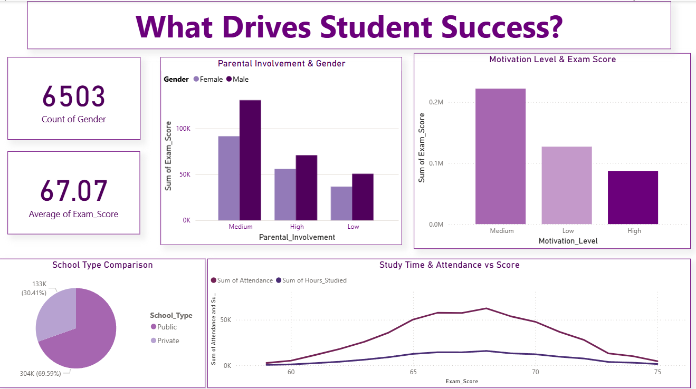
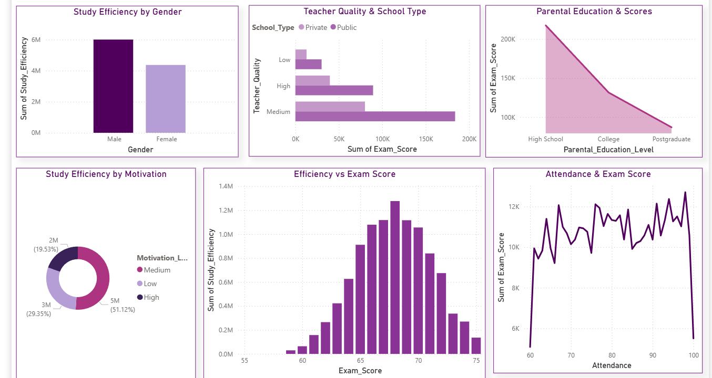

# Student Performance Analysis 📊🎓

This project analyzes student performance data using Python and Power BI, focusing on various factors such as motivation, teacher quality, wellness, and school type.

## 🔧 Tools & Technologies Used
- Python (Pandas, NumPy, Matplotlib, Seaborn)
- Power BI
- Google Colab / Jupyter Notebook
- Excel
- Data Preprocessing techniques

## 📁 Project Structure
-Student-performance-analysis.ipynb (Main notebook)
-Student_Performance_Raw.csv (Original dataset)
-Student_Performance_Cleaned.csv (After preprocessing)
-PowerBI_Dashboard.pbix (Interactive dashboard)

## 📊 Dashboard Insights
The Power BI dashboard provides:
- A pie chart showing the impact of teacher quality and school type on performance
- A line chart comparing test scores and parental involvement
- Motivation level summaries

## 💡 Key Findings
- Motivation level and wellness strongly influence performance
- Private schools show a slight edge in average scores
- High teacher quality is correlated with better student outcomes

## ✍️ Author
Mariam Mohamed Naiem – AI & ML and Data Analysis Engineering Student

---

> Made with ❤️ for data-driven education insights

## 📸 Screenshots

### Overall Dashboard View

### Motivation vs Performance

